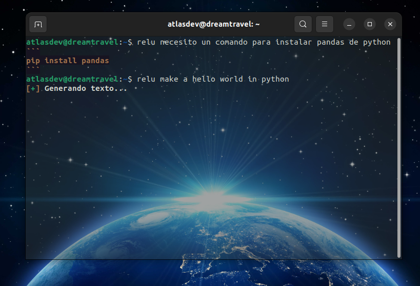

---

<h1>ReLU 🤖</h1>

## Descripción 📝

ReLU es un asistente conversacional creado con el objetivo de <b>optimizar el desarrollo y productividad</b> de los desarrolladores que requieran un acceso simple de asistencia sin requerir de un navegador, lo que permite crear un nuevo <i>paradigma</i>, donde la búsqueda de información, o de solucionar un bug, no requiera de entrar a un navegador, con este proyecto, estoy proponiendo el uso de modelos conversacionales a través de la terminal, donde, para hablar con el modelo conversacional, únicamente se requiere de escribir el comando <code>relu</code> y obtener una Key de acceso <b>GRATUITA</b> de <i>Gemini</i> en <a href="https://ai.google.dev/">la plataforma oficial de Gemini desarrollada por Google</a>.

## Objetivos 🎯

Acelerar la <i>obtención de información o depuración</i> que se encuentren en una terminal usando modelos conversacionales, con una instalación demasiado fácil, lo que puede ayudar a muchos programadores, que usan la terminal para desarrollar software o administrar sistemas, y muchas veces requieren de <b>NO</b> entrar a un navegador para solucionar un error porque demandaría mucho tiempo, o porque no tienen una cuenta asociada en alguna plataforma que brinda dicho servicio, por lo que, un <b>asistente conversacional</b> que pueda ayudar desde la misma terminal, puede ser indispensable.

## Funcionalidades 💡

ReLU tiene la capacidad de hablar con el usuario de muchos temas, y la interacción con el modelo no va a demandar grandes cantidades de dinero porque dicho servicio consume la <a href="https://ai.google.dev/docs?hl=es-419">API de Gemini</a>, a través de servicios de manera gratuita, lo cual, el sistema cuenta con las siguientes capacidades:
- Interactuar con el usuario a través de <b>la terminal</b>.
- Una <b>extensa memoria</b> para entablar conversaciones coherentes y largas.
- La capacidad de <i>enviar notificaciones</i> desde el GUI del escritorio cuando la memoria de ReLU está limpia.
- Limpiar <i>la memoria del asistente</i> cuando desee, lo que permite iniciar conversacionales desde cero.
- Controlador de tokens de la conversación.
- <u>Gracias a la API</u>: Máximo 60 consultas por minuto.
- <u>Gracias a la API</u>: Una conversación de máximo 30.000 tokens.

## Requisitos 🛠️

- <code>google-generativeai</code> Librería para la interacción con la API de Google Gemini.
- <code>notify2</code> Librería para enviar notificaciones a través de la pantalla del escritorio.
- <code>psutil</code> Librería para le obtención de información del sistema operativo.

## Instalación 💻

Para instalar correctamente el bot, sigue los siguientes pasos:

1) Clonar este repositorio:
    - <code>git clone https://github.com/TechAtlasDev/ReLU-assistant</code>

 

2) Entrar al directorio:
    - cd ReLU-assistant

 

3) Instalar python si no lo tienes instalado:
    - Para Ubuntu: <code>sudo apt install python3 -y</code>
    - Para Termux: <code>apt install python3 -y</code>

 

4) Instalar las dependencias y configurar a ReLU:
    - El setup es tan simple como poner el siguiente comando: <code>bash setup.sh</code>

 

5) Usar el modelo!:
    - Puedes iniciar con el comando <code>relu</code> lo que te permitirá obtener ejemplos de uso y parámetros disponibles.

## Compatibilidad 🔨

|   Entorno   | Es compatible | Probado en |
|:------------:|:------------:|:------------:|
|   Windows   |   ❌   |   ❌   |
|   Linux     |   ✅   |   ✅   |
|   Termux    |   ✅   |   ✅   |

## Idiomas 🗣️

|   Idioma   | Disponibilidad |
|:------------:|:------------:|
|   Español   |   ✅   |
|   Ingles     |   ✅   |

## Screenshot 📸

